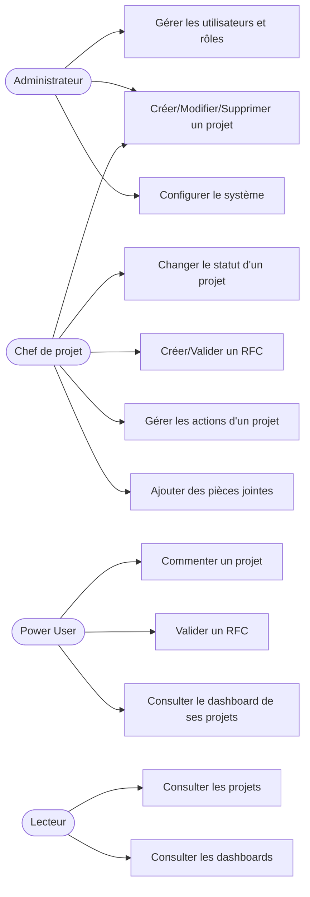

```mermaid
flowchart LR
    Admin([Administrateur])
    ChefProjet([Chef de projet])
    PowerUser([Power User])
    Lecteur([Lecteur])
 
    Admin --> UC1[Gérer les utilisateurs et rôles]
    Admin --> UC2[Créer/Modifier/Supprimer un projet]
    Admin --> UC3[Configurer le système]

    ChefProjet --> UC2
    ChefProjet --> UC4[Changer le statut d'un projet]
    ChefProjet --> UC5[Créer/Valider un RFC]
    ChefProjet --> UC6[Gérer les actions d'un projet]
    ChefProjet --> UC7[Ajouter des pièces jointes]

    PowerUser --> UC8[Commenter un projet]
    PowerUser --> UC9[Valider un RFC]
    PowerUser --> UC10[Consulter le dashboard de ses projets]

    Lecteur --> UC11[Consulter les projets]
    Lecteur --> UC12[Consulter les dashboards]
```