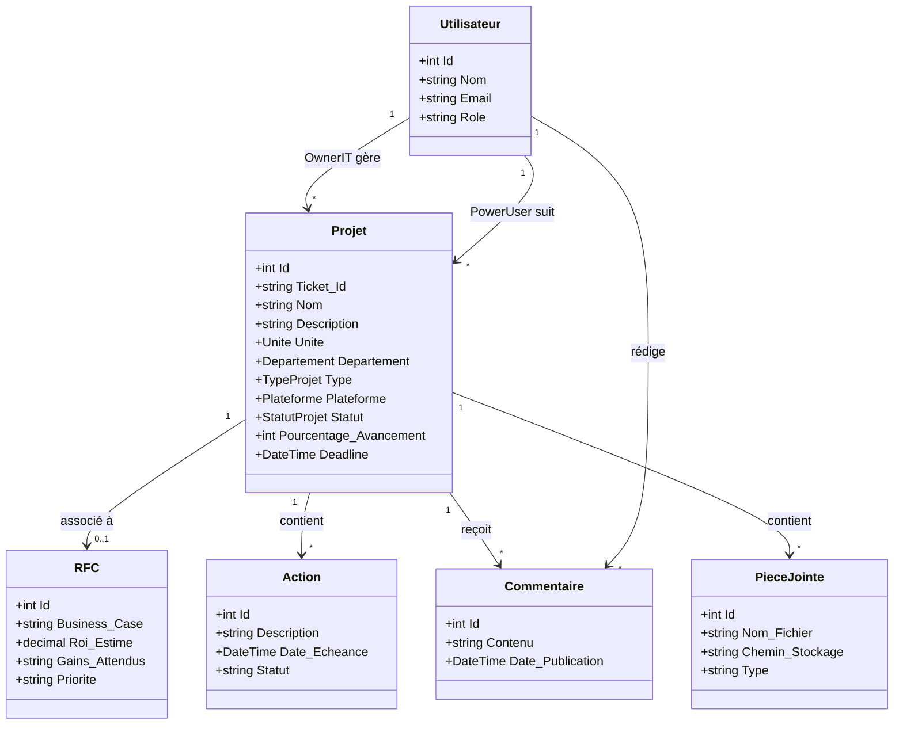

```mermaid
classDiagram
    class Utilisateur {
        +int Id
        +string Nom
        +string Email
        +string Role
    }

    class Projet {
        +int Id
        +string Ticket_Id
        +string Nom
        +string Description
        +Unite Unite
        +Departement Departement
        +TypeProjet Type
        +Plateforme Plateforme
        +StatutProjet Statut
        +int Pourcentage_Avancement
        +DateTime Deadline
    }

    class RFC {
        +int Id
        +string Business_Case
        +decimal Roi_Estime
        +string Gains_Attendus
        +string Priorite
    }

    class Action {
        +int Id
        +string Description
        +DateTime Date_Echeance
        +string Statut
    }

    class Commentaire {
        +int Id
        +string Contenu
        +DateTime Date_Publication
    }

    class PieceJointe {
        +int Id
        +string Nom_Fichier
        +string Chemin_Stockage
        +string Type
    }

    Utilisateur "1" --> "*" Projet : OwnerIT gère
    Utilisateur "1" --> "*" Projet : PowerUser suit
    Projet "1" --> "0..1" RFC : associé à
    Projet "1" --> "*" Action : contient
    Projet "1" --> "*" Commentaire : reçoit
    Projet "1" --> "*" PieceJointe : contient
    Utilisateur "1" --> "*" Commentaire : rédige
```